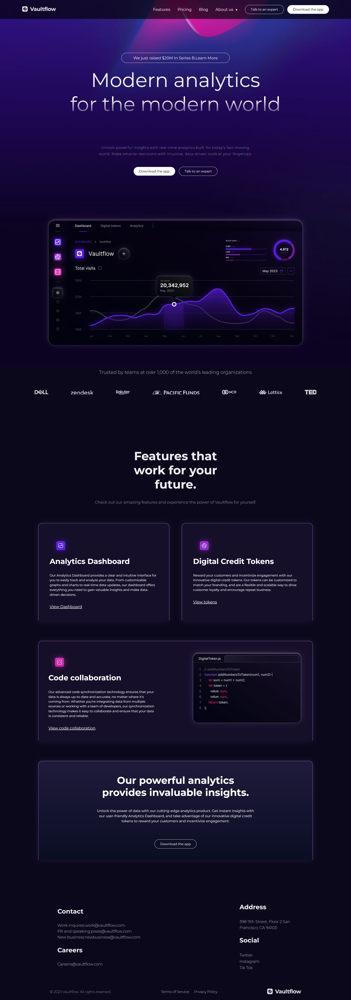

# Vaultflow – Futuristic SaaS Web Application

**Vaultflow** is a sleek, responsive SaaS landing page inspired by futuristic UI/UX design trends. Built using **React.js**, this project showcases a  animated hero section, and clean component-based code structure—ideal.

### 🚀 Live Preview

[Check it out here ](https://vaultflow-saas-webpage.netlify.app/)

## 📸 Preview

 

---

## 🌟 Features

- 🔥 Fully Responsive Design (Mobile, Tablet, Desktop)
- 🧠 Modern Hero Section with Gradient Background and CTA
- 📁 Organized Folder Structure (React best practices)
- 🎯 Styled using clean CSS with modern typography (Google Fonts)
- 📌 Dropdown Navigation with Hover Effects
- 🌐 Hosted & Version Controlled via GitHub

---

## 💻 Technologies Used

- **React.js**
- **HTML5 + CSS3**
- **JavaScript (ES6+)**
- **Google Fonts**
- **Responsive Design (Media Queries)**

---

